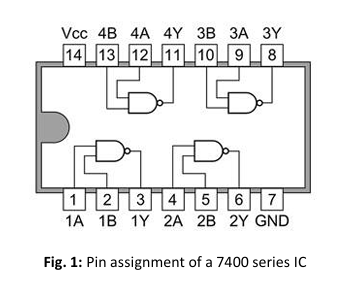

# Lab 01 – NAND Logic & Timing Analysis

This laboratory focused on analyzing the static and dynamic behavior of the 7400 NAND gate.

The objective was to investigate real timing effects in digital circuits and understand how propagation delays influence signal integrity.

---

## 🔧 Hardware Used

- 7400 Series NAND IC
- SSI Evaluation Board
- Function Generator
- Oscilloscope
- MODSYS 2.0 Evaluation Board

---

## 📌 Experiments Performed

- Verification of NAND truth table
- Measurement of rise and fall times
- Propagation delay measurement
- Cascaded gate delay analysis
- Glitch (hazard) observation

---

## 📷 Key Setup – Glitch Measurement

  

The glitch occurs due to unequal propagation delays in different signal paths, producing short transient pulses during switching.

---

## 📷 7400 NAND Pin Assignment

  

Correct pin alignment is critical to prevent permanent IC damage.

---

## ⚙️ Core Concepts

- CMOS voltage levels
- Propagation delay (tpd)
- Rise time (tr) and fall time (tf)
- Static hazards (glitches)
- Cascaded gate delay accumulation

---

## 🎯 Learning Outcome

This lab demonstrated that real digital systems are not ideal.  
Signal transitions require finite time, and timing mismatches can create unintended behavior.

Understanding these effects is essential for reliable hardware design.
