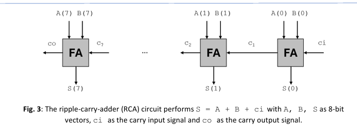
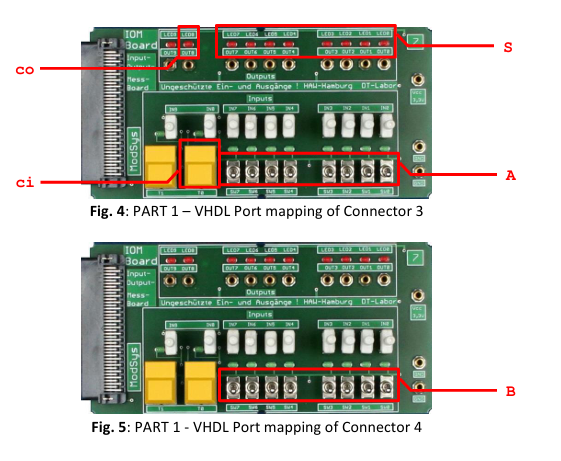
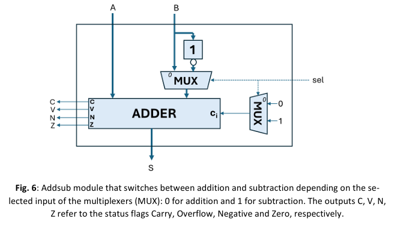
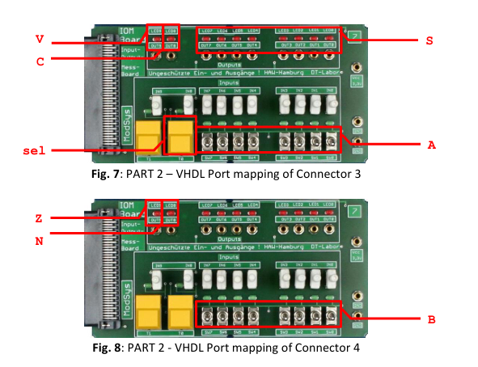

# Lab 02 – 8-Bit Adder/Subtractor & Status Flags

This laboratory focused on designing and extending an 8-bit ripple carry adder to perform both addition and subtraction using 2’s complement arithmetic.

The objective was to implement arithmetic functionality in VHDL, generate processor-style status flags, and analyze timing behavior after FPGA implementation.

---

## Hardware Used

- MODSYS 2.0 Evaluation Board (XC7A100T)
- Two IOM Extension Boards
- Vivado Design Suite
- Oscilloscope

---

## Experiments Performed

- Implementation of 8-bit Ripple Carry Adder
- Extension to Adder/Subtractor (AddSub)
- Implementation of status flags (C, V, N, Z)
- Behavioral simulation using testbench
- FPGA mapping using XDC constraints
- Timing analysis (Synthesis & Implementation)
- Hardware validation on MODSYS board

---

## Ripple Carry Adder Architecture

  

The ripple carry adder performs:

S = A + B + ci

Where:

- A, B → 8-bit operands
- ci → carry input
- S → 8-bit result
- co → carry output

The carry propagates sequentially from the least significant bit (LSB) to the most significant bit (MSB).

This directly affects the overall propagation delay of the circuit.

---

## FPGA Port Mapping – Adder

  

- Switches → Operands A and B
- Button → Carry input (ci)
- LEDs → Sum (S) and Carry output (co)

Correct constraint mapping ensured proper FPGA hardware interaction.

---

## Adder/Subtractor Extension (Task 2)

The adder was extended to support subtraction using 2’s complement arithmetic.

Subtraction is achieved by:

- Inverting operand B
- Setting carry input to 1
- Using a multiplexer controlled by a select signal (sel)

sel = 0 → Addition  
sel = 1 → Subtraction  

---

## AddSub Block Diagram

  

The multiplexer selects whether the circuit performs addition or subtraction before feeding the operands into the ripple carry adder.

---

## FPGA Port Mapping – AddSub

  

- Switches → Operands A and B
- Button → Select (sel)
- LEDs → Result (S)
- Additional LEDs → Status flags (C, V, N, Z)

---

## Status Flags Implemented

| Flag | Description |
|------|------------|
| C | Carry flag (unsigned overflow) |
| V | Overflow flag (signed overflow) |
| N | Negative result indicator |
| Z | Zero result indicator |

These flags allow detection of arithmetic conditions similar to a processor ALU.

---

## Core Concepts

- Ripple carry architecture
- 2’s complement subtraction
- Signed vs unsigned overflow
- Status flag generation
- FPGA constraint mapping (.xdc files)
- Synthesis vs implementation timing analysis
- Propagation delay accumulation

---

## Outcome

This lab demonstrated how arithmetic circuits can be extended from basic adders to functional ALU-like units.

It showed how:

- Subtraction can be implemented using 2’s complement
- Overflow detection differs for signed and unsigned operations
- Status flags are essential in processor architectures
- Timing behavior changes after FPGA implementation

Understanding arithmetic logic design and timing analysis is fundamental for reliable digital system development.
