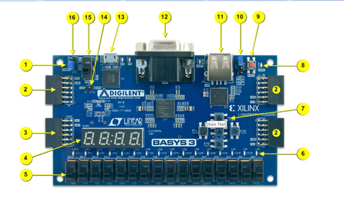
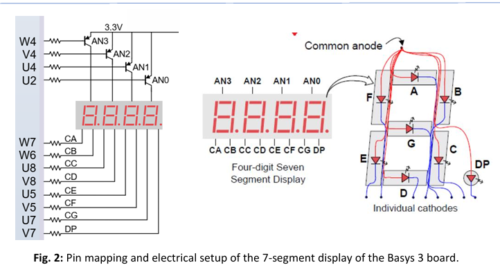
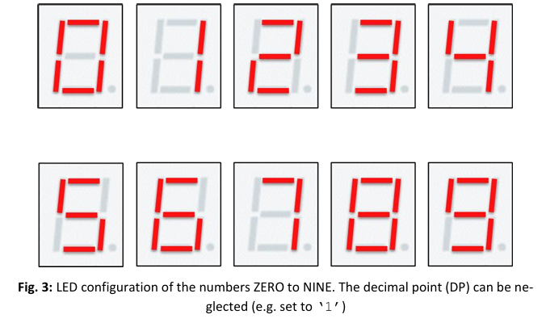

# Lab 03 – 7-Segment Display & Finite State Machine (FSM)

This laboratory focused on controlling the 4-digit 7-segment display of the Basys 3 board using VHDL.

The objective was to implement decimal digit encoding, digit multiplexing via FSM, and counter-based display control.  
Additionally, timing behavior after FPGA implementation was analyzed.

---

## Hardware Used

- Basys 3 FPGA Board (XC7A35T-1CPG236C)
- Vivado Design Suite
- On-board switches (SW0–SW15)
- On-board push buttons
- 4-digit 7-segment display

---

## Development Environment

- Device: **XC7A35TCPG236-1**
- VHDL implementation
- XDC constraint file (predefined, not modified)
- Synthesis → Implementation → Bitstream generation
- Timing analysis via Vivado

---

## Basys 3 Board Overview

  

The Basys 3 board provides switches, LEDs, pushbuttons, and a multiplexed 4-digit 7-segment display.  
All peripherals are controlled via the Artix-7 FPGA fabric.

---

## 7-Segment Display Architecture

  

Each digit consists of:

- 7 LED segments (CA–CG)
- Decimal point (DP)

Important characteristics:

- **Common anode configuration**
- **Low-active control**
- Digit selection via **AN0–AN3**
- One-hot multiplexing scheme

Setting a segment to `'0'` switches it ON.  
Setting a digit select (ANx) to `'0'` activates that digit.

---

## Decimal Digit Encoding (0–9)

  

Preparation task:

- Implement bit patterns for constants ZERO to NINE
- Map segments CA–CG correctly
- Decimal point (DP) set to `'1'` (ignored)

The encoding defines which segments are active for each decimal number.

---

## Laboratory Tasks

### T0 – Project Setup

- Create a new Vivado project for the Basys 3 board
- Add provided VHDL design files
- Use predefined constraint file
- Generate bitstream and program FPGA

---

### T1 – Static Digit Selection

- Assign a fixed number (e.g., NINE) to LED outputs
- Select a specific digit (e.g., AN2)
- Verify correct display behavior

---

### T2 – FSM-Based Digit Control (Mealy Style)

- Use switches SW0–SW1 to select active digit
- Implement a state machine
- Use binary-encoded state as display value
- Immediate output reaction (Mealy behavior)

---

### T3 – Registered Switch Input (Moore Style)

- Copy SW0–SW1 into a register first
- State changes synchronized to clock
- Output depends only on current state

This demonstrates the difference between:

- **Mealy FSM** (output depends on state + input)
- **Moore FSM** (output depends only on state)

---

### T4 – Counter-Based Number Generation

- Implement a 28-bit unsigned counter
- Increment every clock cycle
- Use the 3 most significant bits
- Display numbers from ZERO to SEVEN

This creates a visible counting behavior on the selected digit.

---

### T5 – Digit Multiplexing

- Sequential activation of AN0–AN3
- Fast switching (human eye perceives static image)
- One-hot encoded digit selection

This technique reduces required FPGA pins.

---

### T6 – Timing Analysis (Implementation)

- Open Implemented Design
- Run Report Timing Analysis
- Inspect:
  - Critical path
  - Worst negative slack (WNS)
  - Setup/hold timing

Reflect timing results in the lab report.

---

## Design File

Main VHDL source:

- `design.vhd`

Contains:

- Digit encoding constants
- FSM implementation
- Counter logic
- Multiplexing control
- Segment output assignment

---

## Outcome

This lab demonstrated how to:

- Control multiplexed displays via FPGA
- Implement FSMs for hardware control
- Synchronize asynchronous inputs
- Generate clock-based timing behavior
- Analyze implementation timing constraints

Understanding display multiplexing and FSM-based hardware control is essential for digital system design and real-time FPGA applications.
