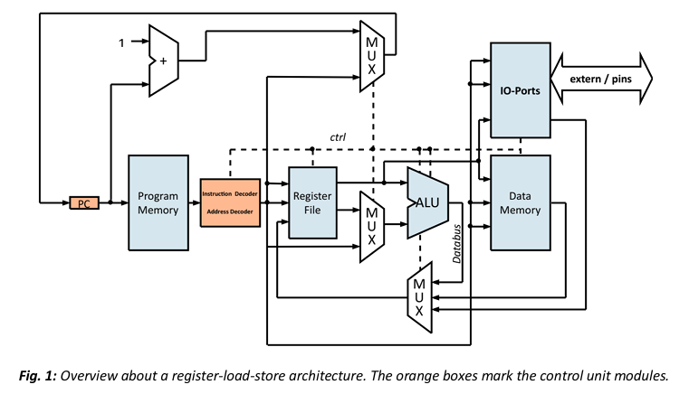
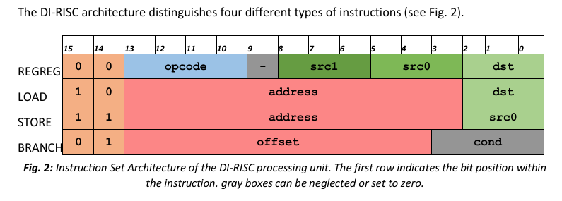
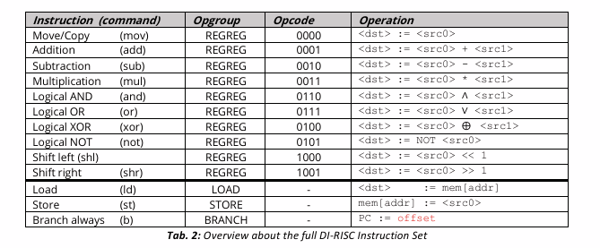
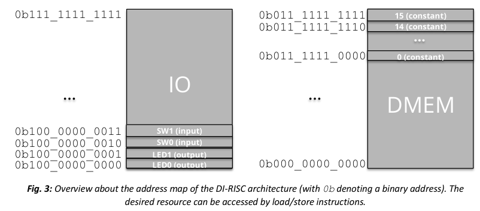
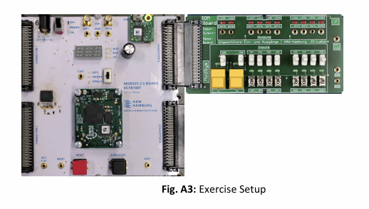

# Lab 04 – DI-RISC Programmable Architecture

This laboratory focused on implementing and validating a simple programmable processing unit (PU) based on a register-load-store RISC architecture.

The objective was to implement instruction decoding, address decoding, machine code execution and memory-mapped IO functionality for the DI-RISC processor.  
The design was validated through behavioral simulation and FPGA implementation on the MODSYS 2.0 evaluation board.

---

## Hardware Used

- HAW MODSYS 2.0 Evaluation Board (XC7A100T-CSG324-1)
- IO-Module Extension Board
- Vivado Design Suite
- Single clock execution mode
- On-board LEDs and Switches

---

## Architecture Overview

<p align="center">
  
</p>

The DI-RISC processor follows a **register-load-store architecture** consisting of:

- Program Counter (PC)
- Program Memory (PMEM)
- Data Memory (DMEM)
- Register File (RF)
- Arithmetic Logic Unit (ALU)
- Control Unit (Instruction + Address Decoder)
- Memory-mapped IO module

The orange blocks represent control logic responsible for decoding instructions and generating control signals.

---

## Architectural Parameters

- Data width: 16 bit  
- Instruction width: 16 bit  
- Data memory: 1024 × 16 bit  
- Program memory: 512 × 16 bit  
- Register file: 8 general-purpose registers (R0–R7)  

The highest 16 addresses of DMEM are reserved for constant values.

---

## Instruction Format

<p align="center">
  
</p>

The DI-RISC architecture distinguishes four instruction types:

### REGREG
```
00 opcode - src1 src0 dst
```

### LOAD
```
10 address dst
```

### STORE
```
11 address src0
```

### BRANCH
```
01 offset cond
```

For this lab only unconditional branches were considered (cond = 0).

---

## Instruction Set Overview

<p align="center">
  
</p>

Supported operations:

- mov
- add
- sub
- mul
- and
- or
- xor
- not
- shl
- shr
- ld
- st
- b

All arithmetic and logical operations are performed exclusively on register operands.

---

## Address Map

<p align="center">
  
</p>

The address space is divided into:

- **DMEM** → address(10) = 0  
- **IO Module** → address(10) = 1  

IO Mapping:

- LED0 (output)
- LED1 (output)
- SW0 (input)
- SW1 (input)

Access to peripherals is done via **memory-mapped IO** using load/store instructions.

Write operations require:
- `wren_s = 1`
- Correct chip select signal (`cs_s`)

---

# PART 1 – Core Unit Implementation

Only the following files were modified:

- `DIRISC_global.vhd`
- `DIRISC_control_unit.vhd`
- `DIRISC_pmem.vhd`

All other architecture modules remained unchanged.

---

## Opcode Definition

Implemented opcode constants in:

- `DIRISC_global.vhd`

These constants define ALU control behavior for REGREG instructions.

---

## Instruction Decoder

Implemented inside:

- `DIRISC_control_unit.vhd`

Responsibilities:

- Extract opcode
- Extract src0, src1, dst
- Generate ALU control signals
- Enable register write
- Handle load/store selection
- Control program counter update

---

## Machine Code Extension

Modified:

- `DIRISC_pmem.vhd`

Extended example program with additional REGREG instructions.

Initial register values:

- R0 = 56
- R1 = 1
- R2 = 7

The additional instructions ensured visible register updates for simulation validation.

---

## Behavioral Simulation

Steps performed:

1. Created new RTL project in Vivado  
2. Added all DI-RISC source files  
3. Set:
   - `DIRISC_top` as Top Module
   - `DIRISC_tb` as Simulation Source  
4. Executed Behavioral Simulation  
5. Loaded waveform configuration `DIRISC_behav.wcfg`

Validated:

- Register value updates
- ALU operation correctness
- PC increment behavior
- Branch functionality

---

# PART 2 – IO Integration

## Address Decoder Extension

Extended the address decoder logic in:

- `DIRISC_control_unit.vhd`

Functionality:

- Distinguish DMEM and IO via address(10)
- Generate chip select signals
- Control write enable (`wren_s`)

---

## IO Machine Code Example

Implemented program that:

1. Loads switch value (SW0)
2. Performs logical left shift
3. Stores result to LED0

This demonstrated correct memory-mapped IO operation.

---

## FPGA Implementation

<p align="center">
  
</p>

Procedure:

- Ran full implementation flow
- Generated bitstream
- Programmed MODSYS board
- Set clock mode to **single execution**
- Verified LED behavior via switches

---

## Timing Analysis

Performed:

- Open Implemented Design
- Report Timing Analysis

Inspected:

- Critical path delay
- Worst Negative Slack (WNS)
- Setup and hold timing

Results were reflected in the final discussion.

---

## Design Files

Core files:

- `DIRISC_global.vhd`
- `DIRISC_control_unit.vhd`
- `DIRISC_pmem.vhd`

Supporting modules:

- `DIRISC_ALU.vhd`
- `DIRISC_RF.vhd`
- `DIRISC_dmem.vhd`
- `DIRISC_IO.vhd`
- `DIRISC_top.vhd`
- `DIRISC_tb.vhd`
- `DIRISC_behav.wcfg`
- `MODSYS2IOM.xdc`

---
## Report

A report was not mandatory for this laboratory. Instead questions were thoroughly asked.

---
## Outcome

This lab demonstrated how a programmable processor architecture can be implemented and validated on an FPGA platform.

Key insights:

- Machine code is translated into control signals by the instruction decoder
- ALU behavior is fully controlled by opcode encoding
- IO peripherals can be accessed via memory-mapped addressing
- Behavioral simulation validates logical correctness
- FPGA implementation validates physical hardware execution
- Timing analysis ensures reliable processor operation

Understanding programmable architectures and control logic is fundamental for digital system design and embedded processor development.