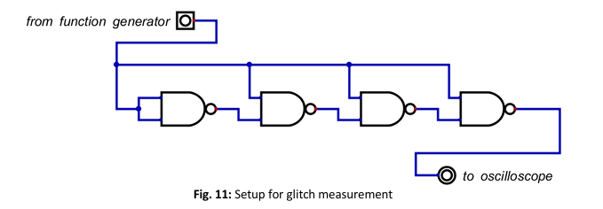

# Digital Circuits (DI)

This repository contains my laboratory work for the course **Digital Circuits (DI)** at HAW Hamburg.

The course focuses on practical digital system design using **VHDL**, FPGA implementation, timing analysis, and programmable processor architectures.

---

## 🔧 Technologies & Tools

- VHDL
- Vivado Design Suite
- FPGA: Artix-7 (XC7A100T / XC7A35T)
- MODSYS 2.0 Evaluation Board
- Basys 3 Board
- Behavioral Simulation & Timing Analysis

---

# 🧪 Laboratory Overview

## Lab 01 – NAND Gate Timing & Glitch Analysis

  

---

## Lab 02 – 8-bit Adder & Add/Sub Architecture

  

---

## Lab 03 – 7-Segment Display & FSM Control

  

---

## Lab 04 – DI-RISC Processor Architecture

  

---

# 📈 Learning Outcomes

- Understanding digital logic timing behavior
- Measuring propagation delay and glitches
- Designing arithmetic units in VHDL
- Implementing FSM-based hardware control
- FPGA synthesis and constraint mapping
- Designing and integrating a simple RISC architecture
- Memory-mapped IO and system-level hardware design

---

# 👤 Author

Robin Faizul Ahmed  
B.Sc. Information Engineering  
HAW Hamburg
